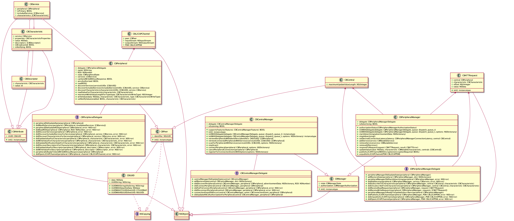

CoreBluetooth是iOS系统提供的关于BLE（低功耗蓝牙）交互的框架，希望这篇文章能够带你看一看CoreBluetooth框架是如何构建的，以及一些可能忽视的细节。
在收看这篇文章之前，希望你对GATT/GAP协议已经有足够的了解；如果你是BLE的初学者，可以先看看我的翻译：
[BLE技术介绍](https://zhongxunchao.github.io/wiki/%E7%BF%BB%E8%AF%91/BLE%E6%8A%80%E6%9C%AF%E4%BB%8B%E7%BB%8D/)

##一般的BLE实现
网上已经有很多iOS上BLE快速集成的方案,我找到了其中一篇：
[iOS BLE开发](https://www.jianshu.com/p/244668e2c959)
可以看到，在一般的BLE开发中，app都是作为center设备，也会用到2个重要的类：CBCentralManager和CBPeripheral.
###1. 初始化CBCentralManager并且设置代理
```
    self.centerManager = [[CBCentralManager alloc]initWithDelegate:self queue:nil];
    self.centerManager.delegate  = self;
```
###2. 开始扫描设备
```
 [self.centerManager scanForPeripheralsWithServices:nil options:@{CBCentralManagerScanOptionAllowDuplicatesKey:[NSNumber numberWithInt:1],CBCentralManagerOptionShowPowerAlertKey:[NSNumber numberWithInt:1]}];
```
###3. 获取设备列表
在CBCentralDelegate的一个方法里获取到CBPeripheral.
```
-(void)centralManager:(CBCentralManager *)central didDiscoverPeripheral:(CBPeripheral *)peripheral advertisementData:(NSDictionary<NSString *,id> *)advertisementData RSSI:(NSNumber *)RSSI{}
```
每当发现新设备就会进入上面的代理方法，一般而言可以新设备放到一个数组，记得在适当的时机停止扫描。

###4. 连接设备
从上面获得的设备列表中选择一个CBPeripheral对象，并进行连接。
```
[self.centerManager connectPeripheral:peripheral options:nil];
```
###5. 发现设备的CBService
```
// 连接设备成功后，发现相关的CBService
- (void)centralManager:(CBCentralManager *)central didConnectPeripheral:(CBPeripheral *)peripheral {
    peripheral.delegate = self;
    [peripheral discoverServices:@[[self.class serviceUUID]]];
}
```
###6. 发现CBCharateristic
这里要注意到一个区别，我们在扫描和连接的过程中，都使用了CBCentralManager对象或者代理方法。但是当设备连接成功后，接下来的CBService和CBCharacteristic将与Centeral设备无关，而是通过CBPeripheral的代理方法继续推进。因此在第5步中我们设置了CBPhripheral的代理对象。
接下来的推进将以CBPhripheralDelegate为主。在发现CBService成功后，将继续发现CBService包含的CBCharacteristic.
```
-(void)peripheral:(CBPeripheral *)peripheral didDiscoverServices:(NSError *)error {
        for (CBService *service in peripheral.services)
    {
        if ([service.UUID isEqual:[self.class serviceUUID]])
        {
            [_peripheral discoverCharacteristics:@[[self.class receiveDataCharacteristicUUID], [self.class sendDataToBandCharacteristicUUID]] forService:service];
        }
    }
}
```
###7. 发现CBCharacteristic成功的回调
当发现BLE特性成功之后，这个连接就成功建立起来了。同时我们要将这个CBCharacteristic保存下来，因为它将是我们读写数据的关键。
这里有一个小小的细节，CoreBluetooth并没有直接在代理方法中将CBCharacteristic暴露出来，因为CBCharacteristic是CBService的属性，所以可以从CBService中获得。
我对iOS这种封装方式持保留意见，一个CBService可以包含多个CBCharacteristic,但是同时CBChaacteritic中也会指明所属的CBService, 因此发现CBCharacteristic的回调直接使用CBCharacteristic可能更加合理，也避免了开发者必须去CBService中进行for循环以获得相应的特性。
```
-(void)peripheral:(CBPeripheral *)peripheral didDiscoverCharacteristicsForService:(CBService *)service error:(NSError *)error
{
    for (CBCharacteristic *characteristic in service.characteristics)
    {
        if ([characteristic.UUID isEqual:[self.class receiveDataCharacteristicUUID]])
        {
            _receiveDataFramBandCharacteristic = characteristic;
            [_peripheral setNotifyValue:YES forCharacteristic:_receiveDataFramBandCharacteristic];
            
        }
        else
        {
           _sendDataToBandCharacteristic = characteristic;
        }
    }
}
```
###8. 接收设备的数据
事实上，在获取到相应的CBCharacteristic之后，就可以轻松的向设备发送数据了。前提是我们已经将CBPeripheral和CBCharacteristic都保存了下来。
```
[peripheral writeValue:data forCharacteristic:characteristic type:CBCharacteristicWriteWithoutResponse];
```
但是如何接收设备的数据呢？注意前一步中我们开启了对特性的数据监听，这样才能进入下面的代理方法：
```
- (void) peripheral:(CBPeripheral *)peripheral didUpdateValueForCharacteristic:(CBCharacteristic *)characteristic error:(NSError *)error
{ 
    NSLog(@"Did update value for characteristicValue: %@\n", characteristic.value);
}
```

这样我们已经完成了BLE交互的所有必须步骤：扫描设备，建立BLE连接，发送和接收数据等。
当然这种很繁琐的代理方法必然不是大多数开发者喜欢的，使用起来非常不方便。比如要连接一个已经知道Service和Characteristic的UUID的设备，我不得不实现很多个代理方法。或者说部分Service是加密的，连接之前必须经过认证，那么后期的连接订阅就非常麻烦。所以后面我也会介绍一些BLE框架的实现思路，以及自己构思的js的BLE库的实现。

##CoreBluetooth的框架概览


上面是我绘制的CoreBluetooth的类图，基本包含了所有用到的类。当我绘制完成这张图的时候，便发现了很多知识的漏洞，定期的梳理是非常有必要的。
### CBUUID
在GATT协议中，Service, Characteristic, Descriptor都有这着相应的UUID，虽然它只是一个2个（官方）或16个（自定义）字节的数据，但是把它抽象出来是很有必要的。它是服务或特性的唯一ID.
### CBAttribute
Attribute（属性）是ATT协议的核心。它是一种数据结构，包含Handle, UUID， Value等信息。
>属性句柄（Attribute Handle）是一个2字节的十六进制码，起始于0x0001，在系统初始化时候，各个属性的句柄逐步加一，最大不超过0xFFFF。这个跟软件编程中的句柄的概念类似，就是某个属性值的查询地址。
属性类型（Attribute Type）用以区分当前属性是服务项或是特征值等，它用UUID来表示。UUID（universally unique identifier，通用唯一识别码）是一个软件构建标准，并非BLE独有的概念，一个合法的UUID，一定是随机的、全球唯一的，不应该出现两个相同的UUID（出现了，就说明它们俩是同一个UUID）。标准的UUID是一串16字节十六进制字符串，如f6257d37-34e5-41dd-8f40-e308210498b4，在网上可以方便的生成一个UUID。
属性值（Attribute Value）是存放数据的地方。如果是服务项或者特征值声明，该数据为UUID等信息，如果是普通的特征值，该数据则是用户的数据。

但是CoreBluetooth在CBAttribute中只暴露了UUID信息，或许是认为Handle和Value对开发者并不是必须用到的，所以没有作为CBAttribute的property.

###CBPeer
CBPeer是对等网络（P2P）中设备的抽象，在BLE中设备与设备之间并不是对等的，天然的划分为central设备和peripheral, 或者client和server。但是对于这种设备的抽象是很有必要的，它可以描述central和peripheral的一些共性。
在CoreBluetooth中，CBPeer只暴露了一个CBUUID作为设备的Identifier, 所以它的接口和CBAttribute是非常像的。这也反映了在软件项目中，概念的清晰比代码冗余更加重要。

###CBService, CBCharacteristic和CBDescriptor
由于Service，Characteristic和Descriptor在GATT协议中都有着明确的定义，因此是易于理解的。
每个Service包含一个或多个Characteristic, 每个Characteristic包含一个或者多个Descriptor.
这三个类都继承于CBAttribute, CBService和CBCharacteristic是互相关联的：CBService中包含一个CBCharacteristic的数组，CBCharacteristic也有一个CBService指向所属的服务。同样的道理，CBCharacteristic和CBDescriptor也是互相关联的。
>关于Descriptor
  一个characteristic包含三种条目：characteristic 声明(Declaration)，characteristic的值(Value)，以及characteristic的描述符(Descriptor)（可以有多个描述符）.Descriptor描述了数据的额外信息，比如温度的单位是什么。CCCD是一种特殊的Descriptor，可以用来打开或关闭特性的Notify功能。

###CBPeripheral和CBPeripheralDelegate
对于一个外设Peripheral而言, 大部分CBPeripheral或者CBPeripheralDelegate里面的方法都是不言而喻的。外设可以主动调用的方法在CBPeripheral的实例方法里，回调的方法在CBPeripheralDelegate里。
我们先看看CBPeripheral中容易理解的方法或属性：
```
// CBPeripheralDelegate代理对象.
@property(weak, nonatomic, nullable) id<CBPeripheralDelegate> delegate;
// 外设名称
@property(retain, readonly, nullable) NSString *name;
// 外设的RSSI强度
@property(retain, readonly, nullable) NSNumber *RSSI;
// 外设的连接状态
@property(readonly) CBPeripheralState state;
// 是否可以发送无响应的消息。
@property(readonly) BOOL canSendWriteWithoutResponse;
// 外设包含的所有Service，而Characteristic包含在Service内。
@property(retain, readonly, nullable) NSArray<CBService *> *services;
// 在设备已经建立连接时，主动读取RSSI值
- (void)readRSSI;
// 发现设备的Services。
- (void)discoverServices:(nullable NSArray<CBUUID *> *)serviceUUIDs;
// 发现Service下面包含的Characteristic。
- (void)discoverCharacteristics:(nullable NSArray<CBUUID *> *)characteristicUUIDs forService:(CBService *)service;
// 主动读取Characteristic的值。
- (void)readValueForCharacteristic:(CBCharacteristic *)characteristic;
// 向Characteristic写入数据.
- (void)writeValue:(NSData *)data forCharacteristic:(CBCharacteristic *)characteristic type:(CBCharacteristicWriteType)type;
// 设置监听Characteristic, 同时该方法也会影响该CBCharacteristic的isNotifying属性。
- (void)setNotifyValue:(BOOL)enabled forCharacteristic:(CBCharacteristic *)characteristic;
// 发现Characteristic下的Descriptor。
- (void)discoverDescriptorsForCharacteristic:(CBCharacteristic *)characteristic;
// 主动读取Descriptor的数据。
- (void)readValueForDescriptor:(CBDescriptor *)descriptor;
// 主动更改Descriptor的值。
- (void)writeValue:(NSData *)data forDescriptor:(CBDescriptor *)descriptor;
```
写到这里我发现对每个函数都用中文描述一遍没有必要，因此接下来我将考察我认为比较难懂的地方。

```
@property(readonly) BOOL ancsAuthorized;
```
>ANCS(Apple Notification Center Service)即Apple通知中心服务,是让周边蓝牙设备（手环、手表等）可以通过低功耗蓝牙访问IOS设备（iphone、ipad等）上的各类通知提供的一种简单方便的机制。
注意和APNS进行区分。
**APNS的实现主要在硬件端，一般并不需要App做任何操作。**
参考：[ANCS协议分析](https://www.jianshu.com/p/2ddf76ab85b0)

ANCS不需要App改动任何代码，只要App正常的完成BLE连接即可，硬件会完成（支持）绑定认证的操作。因此该属性是标记该外设是否已经完成ANCS认证。

```
- (void)discoverIncludedServices:(nullable NSArray<CBUUID *> *)includedServiceUUIDs forService:(CBService *)service;
```
在GATT协议中，所有的Service可以分为2种：
- 主要服务（Primary Service）:拥有基本功能的服务,可被其他服务包含,可以通过Primary Service Discovery过程来发现
- 次要服务(Secondary Service):仅用来被Primary/Other Secondary Service、高层协议引用的服务,不会被Central设备发现。
>当一个服务需要用到别的服务里面的某些值的时候，也可以通过«Include»来完成。
然而， «Include»一定是在服务声明之后才能使用的，那么服务声明有两种方式，首要服务可以引用另一个首要服务。首要服务也可以引用一个次要服务，从而使用次要服务公开行为。次要服务可以引用一个次要服务或者首要服务。不过次要服务引用次要服务情况很少，次要引用首要服务就更少了。
参考：[GATT服务构成](https://blog.csdn.net/yk150915/article/details/87618584)

现在我们可以解释该方法的作用：它允许我们去发现某个Service内部的引用的其他Service。

```
- (NSUInteger)maximumWriteValueLengthForType:(CBCharacteristicWriteType)type;
```
看以下这个WriteType的定义,其含义无需多说：
```
typedef NS_ENUM(NSInteger, CBCharacteristicWriteType) {
	CBCharacteristicWriteWithResponse = 0,
	CBCharacteristicWriteWithoutResponse,
};
```
这个函数返回了对特定类型Characteristic的最大数据长度。
但是我认为这个方法里面有3个疑问：
* 1. 对于不同的Characteristic这个可写的length是否可能不同？

* 2. 为什么不同的CBCharacteristicWriteType参数可能得到不同的返回结果？

* 3. 发送和接收的数据的最大长度是否总是一致的？

我查阅了国内外一些资料，并没有发现能够很清晰的解决这些疑问的。

对于第一个疑问，个人的理解是这个可写长度实质上取决于ATT的MTU的限制，那么该最大长度应该对于不同的特性应该是一致的，因为GATT协议处于协议栈的最上层了。同时根据这个解释，发送和接收的数据的最大长度也应该是一致的。
第二个问题, stackoverflow上的一个[回答](https://stackoverflow.com/questions/41289783/what-does-peripheral-maximumwritevaluelengthfortypecbcharacteristicwritewithre)只是说我们应该尽可能避免发送超出这个最大值的数据，同时对于WithResponse类型的特性，可能会返回512. 我将测试对于WithoutResponse类型会返回多少。
 <font color='red'> WARNING: 对于该方法的说明待完善。</font>

 ```
 - (void)openL2CAPChannel:(CBL2CAPPSM)PSM;
 ```
这个函数让我比较困扰，L2CAP是BLE协议栈中非常重要的一层，但是在一般的BLE开发中，这一层的数据都已经封装好了。所以我花了很多时间尝试理解该函数的使用场景。
L2CAP层解决了一个重要的问题，就是协议/信道的多路复用。同时提供了两种多路复用的手段：基于连接的多路复用和无连接的方法。
PSM，即Protocol/Service Multiplexing, 是无连接复用中的一个字段，可以把它当作CID(Channel ID)的一种替代。
那么该函数就是可以（基于无连接的方式？）打开新的L2CAP信道。而PSM是CBL2CAPChannel类的一个属性。在一般的BLE开发中，都会通过Characteristic去发送和接收数据，而在外设主动放开L2CAP信道的情况下，Central设备和外设是可以以数据流的方式直接进行通信的。此时Central设备就要调用该函数去打开该Channel。
 <font color='red'>这也是我未曾实现的内容，我将通过2个iOS App来测试该功能.</font>

###CBManager
前面提到一般BLE的开发时，主要用到两个类：CBCentralManager和CBPeripheral.
在思考iOS对于CoreBluetooth的设计时，一个有趣的点是框架将CBCentral和CBCentralManager区分开，CBPeripheral和CBPeripheralManager同样如此。理解了这样的设计逻辑，我们才能知道CBManager在框架中的作用。
以我的理解看，CBCentral在框架中的作用是非常弱的，几乎不会用到，或者说，它是可以被CBCentralManager完全替代的。设想一个iOS app初始化一个Central（可能是单例）然后设置CentralDelegate来监听Central设备的各种变化，看上去也是可行的。
而CBPeripheral和CBPeripheralManager却并非可以互相替代的。比如CBPeripheral包含了发现Service和Characteristic和读写数据的方法，而CBPeripheralManager描述了如果一个iOS App想要作为Peripheral而不是Central设备，应该如何去广播，构建Service等内容。而Central设备不需要这些构建，因此CBCentral看起来根本没做什么事。
回过头来看CBManager作为CBCentralManager和CBPeripheralManager抽象出来的父类，包含了打开/关闭等状态以及认证相关的属性；再次思考一下，这些属性作为设备的一个属性也是可行的，比如加入到CBPeer里面。但是这样一来，将CBPeripheral和CBPeripheralManager合并的话，里面包含的方法会非常广泛，而逻辑仍然是自洽的。

###CBCentralManager和CBCentralManagerDelegate
```
- (NSArray<CBPeripheral *> *)retrievePeripheralsWithIdentifiers:(NSArray<NSUUID *> *)identifiers;
```
重连已知的 peripheral 列表中的 peripheral,这些外设是已经发现或者已经连接过的。
```
- (void)registerForConnectionEventsWithOptions:(nullable NSDictionary<CBConnectionEventMatchingOption, id> *)options;
```
会对连接的Event进行注册和监控，如果Event发生，将会在CBCentralManagerDelegate里面的centralManager:connectionEventDidOccur:forPeripheral:进行响应。
这些Event包括：
```
typedef NS_ENUM(NSInteger, CBConnectionEvent) {
	CBConnectionEventPeerDisconnected = 0,
	CBConnectionEventPeerConnected	= 1,
};
```
**CBCentralManagerDelegate**
```
- (void)centralManager:(CBCentralManager *)central willRestoreState:(NSDictionary<NSString *, id> *)dict;
```
当app即将进入后台或者被唤醒时，可以获取需要恢复的的CBCentralManager状态数据。参见：
[CoreBluetooth的后台工作模式](https://www.dazhuanlan.com/2020/01/21/5e2704fb6b8df/)
该后台模式值得进一步探究。

```
- (void)centralManager:(CBCentralManager *)central didUpdateANCSAuthorizationForPeripheral:(CBPeripheral *)peripheral;
```
参考前面对于ANCS的解释，即当一个ANCS设备的认证状态发生变化时，该方法将被调用。

###CBAttRequest
代表了来自central设备的一个读或者写数据的请求。
GATT协议中定义了Server/Client的概念，外部设备(Peripheral)又被称为GATT服务器，central设备自然是客户端的概念。因此central可以向GATT Server发出请求，这个请求就是CBAttRequest.
由于CBAttRequest只能从Central设备发向Peripheral,也就是说只有当iOS设备作为外设收到请求时，该类才会被使用。这就是我们会看到为什么CBAttRequest只在CBPeripheralManager和CBPeripheralManagerDelegate里面使用。那么CBAttRequest的属性也就一目了然了：
```
// 请求的来源设备。
@property(readonly, nonatomic) CBCentral *central;
// 将要被读写的特性。
@property(readonly, nonatomic) CBCharacteristic *characteristic;
// 读写数据的位移量。
@property(readonly, nonatomic) NSUInteger offset;
// 如果是写数据的请求，这就是要写的数据；否则为nil。
@property(readwrite, copy, nullable) NSData *value;
```

###CBPeripheralManager和CBPeripheralManagerDelegate
如果将iOS设备作为Peripheral而不是Central，那么我们就要定义这个Peripheral的广播,Service,Characteristic等内容。这时候就必须要用到CBPeripheralManager.
```
- (void)setDesiredConnectionLatency:(CBPeripheralManagerConnectionLatency)latency forCentral:(CBCentral *)central;
```
可以设置期待的连接延迟。首先看看CBPeripheralManagerConnectionLatency的定义：
```
typedef NS_ENUM(NSInteger, CBPeripheralManagerConnectionLatency) {
	CBPeripheralManagerConnectionLatencyLow = 0,
	CBPeripheralManagerConnectionLatencyMedium,
	CBPeripheralManagerConnectionLatencyHigh
} NS_ENUM_AVAILABLE(10_9, 6_0);
```
这里需要了解一下Link Layer(链路层)是如何知道数据包发送成功与否的。在各种client的BLE框架中，都有着关于数据包发送成功与否的回调。这个背后实质上是链路层数据的交换，即使没有显性的GATT数据交互。
>两个设备使用特定的信道发送和接收数据，然后过一段时间后再使用新的信道（BLE协议栈的链路层处理信道的切换）。两个设备在切换信道后发送和接收数据称为一个连接事件。尽管没有应用数据被发送和接收，两个设备仍旧会交换链路层数据（空包 Empty PDU）来维持连接。
参见：[BLE连接事件](https://www.cnblogs.com/dirt2/p/6210837.html)

那么当ConnectionLatency设置为Low或者0时，central设备发包后，slave一定会回复PDU包，否则central就认为该数据接收不正常。这样可以确保发送消息的稳定性，但是同时增加了电池耗电量。
而ConnectionLatency设置为Medium或者High时，会忽略中间的某些连接事件，然后间隔性的回复central来节省电量。

```
- (void)respondToRequest:(CBATTRequest *)request withResult:(CBATTError)result;
```
当创建的PeripheralManager接收到来自central设备的读或写的请求CBATTRequest时，可以通过该函数来告诉central设备该请求发送成功或者失败原因。
但是CBATTError中包含了成功状态CBATTErrorSuccess，而参数命名为result似乎有一定歧义，可能使用例如CBATTRequestStatus更加直观一些。
```
- (BOOL)updateValue:(NSData *)value forCharacteristic:(CBMutableCharacteristic *)characteristic onSubscribedCentrals:(nullable NSArray<CBCentral *> *)centrals;
```
通过某个特性向central设备更新数据。
**CBPeripheralManagerDelegate**
```
- (void)peripheralManagerIsReadyToUpdateSubscribers:(CBPeripheralManager *)peripheral;
```
如果某次向central设备更新数据失败，当peripheralManager重新准备更新数据时，该回调将会被触发。

那么到此处关于CoreBluetooth框架的解析就告一段落了，该框架按照BLE协议栈中的最上面的GATT/GAP/ATT协议以及极少的L2CAP层构建了完整的central或periphral设备的所需功能。
但是对于这种框架来说，使用起来需要通过各种Delegate进行交互，实质上带来了很大的不方便。比如开发者可能更加希望，能够通过一个central的构建完成所有的功能，因此在很多团队会进行一些封装，也有比较成熟的第三方库。
而且该框架同时提供了central或者peripheral设备的构建功能，对于一般只将App作为central设备的开发者而言，只是增加了理解的复杂度。就我个人而言，peripheral和peripheralManager的区分并非那么明显，命名是可以斟酌的。
如果有时间，我将试着解析一个流行的BLE库RxBluetoothKit, 看看相对原生CoreBluetooth, 它做了哪些优化。

同时我将会试着在不参考其他任何Demo或者文档的情况下，去构建一个Peripheral, 并且与另一个Central设备通信,来检验自己的理解是否足够透彻。

##参考资料
* [ANCS协议分析](https://www.jianshu.com/p/2ddf76ab85b0)
* [ANCS Spec](https://link.jianshu.com/?t=https://developer.apple.com/library/content/documentation/CoreBluetooth/Reference/AppleNotificationCenterServiceSpecification/Introduction/Introduction.html#//apple_ref/doc/uid/TP40013460-CH2-SW1)
* [GATT服务构成](https://blog.csdn.net/yk150915/article/details/87618584)
* [CoreBluetooth的后台工作模式](https://www.dazhuanlan.com/2020/01/21/5e2704fb6b8df/)
* [BLE连接事件](https://www.cnblogs.com/dirt2/p/6210837.html)

##待解决问题：
* maximumWriteValueLengthForType:函数

