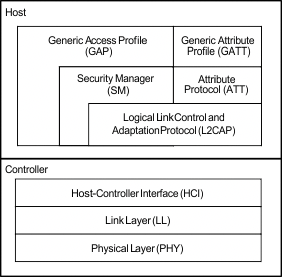
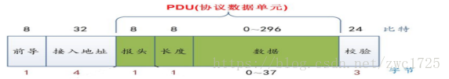

我已经翻译了一篇文章：[BLE技术介绍](https://zhongxunchao.github.io/wiki/%E7%BF%BB%E8%AF%91/BLE%E6%8A%80%E6%9C%AF%E4%BB%8B%E7%BB%8D/) 
里面介绍了BLE在GAP和GATT上的实现，这篇文章希望能够系统探索BLE从应用层到物理层的基本实现，以及其他需要补充的一些内容。最权威的资料来源于[Bluetooth Low Energy Software Developer’s Guide](https://www.ti.com/lit/ug/swru271i/swru271i.pdf?ts=1592264196467&ref_url=https%253A%252F%252Fwww.ti.com%252Ftool%252FBLE-STACK)
##蓝牙协议栈描述
协议栈的层次如下：

那么这里涉及到2个重要的概念：host和controller。 一般而言，controller是指跑在蓝牙模块上，更底层的那部分协议栈，而host是指跑在AP芯片，更接近应用层的部分。一般的移动应用开发只需要和host打交道，而host和controller可以通过HCI协议进行通信。其他的协议栈方案请参见引用文档。
>HCI协议是一个传输层协议，位于蓝牙高层协议和低层协议之间，提供了对基带控制器和链路管理器的命令以及访问蓝牙硬件的统一接口,它是我们实现自己的蓝牙设备要接触的第一个蓝牙协议,起着承上启下的作用。参见：[蓝牙HCI协议](https://blog.csdn.net/hushiganghu/article/details/61919261)

下面将对各层协议进行一定的描述。

##物理层
蓝牙是无线通信的一种，所以其通信介质是某个频率范围的频带资源.
物理层是通过BLE射频信号实现的，本身只负责发送和接收数据，
蓝牙是一种工业和民用，所以使用了免费的ISM频段, 在2400MHz -2480MHz范围。为了同时支持多个设备，将频段分为40份，每份的带宽为2MHZ，也就是RD Channel. 可以看到，蓝牙所分配的频段都是在2.4GHZ的。
BLE使用跳频技术来解决频段拥挤问题,这里不多展开。
>BLE广播信道一共有3个，分别为37、38和39信道，频点分布分别为2402MHz、2426MHz和2480MHz，这3个信道用于发送广播信息，广播信道分散在距离较远的频段上，过度的集中会导致如果该频段受干扰严重可能广播就无法进行的情况，分散的目的是为了增加容错率。剩下的37个频点用于通信，即连接以后用于数据交流。

##链路层（Link Layer）
在物理层已经解决了基本的通信问题，但是蓝牙所在频段非常拥堵，干扰多，通信实体多，因此链路层需要解决以下问题：
* 诸多通信实体的Channel共享问题；
* 构建两个通信实体的逻辑链路(Logical Link);
* 数据传输可能损毁、丢失，需要提供校验、重传等机制，确保数据传输的可靠性。

在链路层抽象出了5种状态：
* Standby State: 初始状态，既不发送数据，也不接收数据.
* Advertising State: 可以通过广播通道发送数据的状态，由Standby状态进入。
* Scanning State： 可以通过广播通道接收数据的状态，由Standby状态进入。
* Initiaing State： 由Standby状态进入，只能接收Advertiser广播的connectable的数据，并在接收到数据后，发送连接请求，以便和Advertiser建立连接。当连接成功后，Initiater和对应的Advertiser都会切换到Connection状态。可以理解为待连接状态。
* Connection State： 已连接状态，和实体建立了单独的通信通道。由Initiating或者Advertising自动切换而来。通道断开后，会重新回到Standby状态。
处于Connection状态的双方，分别有2种角色：
* Initiater方称作Master.
* Advertiser方称作Slave.
>从横向看，BLE协议栈的每个层次都是可以互相通信的实体；在每个层次上，都可能有状态定义，甚至有同名的状态。只需要多加注意即可。
###空中接口协议（Air Interface Protocol）
AIP定义了物理层上收发的数据包的格式,并且这种格式对于广播频段和数据频段都是适用的。

这些格式从前到后分别为：
* Preamble: 1 byte, 前导帧。根据物理层行为取值为0x55或者0xAA.
* Access Address: 4 byte, 标记数据包或广播包.广播包该字段固定为0x8E89BED6.数据包的字段将是由initiator在建立连接时生成的32bit的随机值.
* PDU： Protocol Data Unit,协议数据单元，下面将会单独描述。
* CRC校验位：3个字节，用于校验数据是否丢失或修改。
####PDU描述

这张图比前面一张描述的更加详细，从图中可以看到，从第3列开始的Advertising Header后连续4列即为PDU的内容。包括了：
* Advertising Header: 1 byte，定义了PDU的type等，不再过多展开。参见：[BLE空口包格式](https://www.cnblogs.com/iini/p/8977806.html)
* Payload Length: 1 byte, 定义了PDU的长度。需要注意的是广播包的PDU最多为37个字节。
* Device Address: 6个字节，即蓝牙的mac地址。所以广播包数据最长只能31个字节。（这里PDU并未计算Header和Payload Length）
* Advertising Data: 数据包或广播包的数据。如果是广播包，该部分最大31个字节。如果是数据包，该部分最大可达257个字节。

链路层的包长度范围为9到264个字节(不计算Preamble,PDU范围2~257 Bytes).

###数据过滤机制
>随着通信设备的增多，空中的广播数据将会呈几何级的增长，为了避免资源的浪费（特别是BLE Host），有必要在Link Layer过滤掉一些数据包，例如根据蓝牙地址，过滤掉不是给自己的packet。

###链路控制协议（Link Layer Control）
该协议用来管理、控制两个链路层实体的connection：
* 更新connection参数；
* 更新连接使用的跳频图谱，使用哪些Channels;
* 执行链路加密相关过程。

##引用文档
* [Bluetooth Low Energy Software Developer’s Guide](https://www.ti.com/lit/ug/swru271i/swru271i.pdf?ts=1592264196467&ref_url=https%253A%252F%252Fwww.ti.com%252Ftool%252FBLE-STACK)
* [蓝牙HCI协议](https://blog.csdn.net/hushiganghu/article/details/61919261)
* [蓝牙协议栈方案](https://www.cnblogs.com/iini/p/8834970.html)
* [BLE从底层到上层](https://blog.csdn.net/wuneiqiang/article/details/100569072)
* [BLE空口包格式](https://www.cnblogs.com/iini/p/8977806.html)