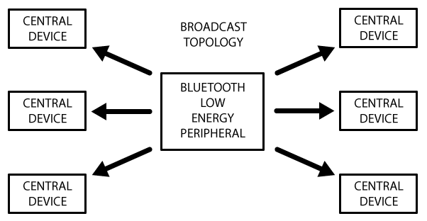
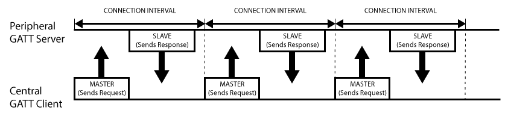

翻译来源：[Introuduction to Bluetooth Low Energy](https://learn.adafruit.com/introduction-to-bluetooth-low-energy?view=all)

#BLE技术介绍
低功耗蓝牙技术（BLE）有时也被称为智能蓝牙，是经典蓝牙的一个轻量级子集。它最初是在蓝牙4.0版本中被提出来的。虽然BLE和经典蓝牙有一些重叠的地方，但是本质上它与经典蓝牙是截然不同的。BLE技术起源于诺基亚一个叫Wibree的内部项目，后来他们的成果被蓝牙技术联盟(Bluetooth SIG)采用。
事实上，有非常多的无线协议供工程师和产品经理选择。但是BLE有趣之处在于，它几乎是以最简单的方式来与移动设备通信，比如Android，iOS或者Windows phone等等。对于iOS设备来说，如果你想避开无底洞来合法地使你的设备进行连接的话，BLE是唯一的硬件设计选项。
本指南提供了BLE技术的概览，特别是BLE中数据的组织方式，数据如何广播，连接并通信等过程。
##BLE平台支持
下列大多数主流平台都是蓝牙4.0和BLE的：

+ iOS5以上（建议iOS7以上）

+ Android4.3以上（很多Bug在Android 4.4以上才修复）

+ OS X 10.6以上

+ Windows 8

+ GNU/Linux Vanilla BlueZ 4.93以上
##GAP(通用访问配置文件)
GAP是通用访问配置文件（Generic Access Profile）的缩写，它控制着蓝牙的连接与广播。GAP使你的设备可以被外部发现，并决定了两个设备直接如何交互。

>补充：GAP协议是对传统蓝牙和BLE都有效的。参考：https://blog.csdn.net/qinrenzhi/article/details/88559230 
后面将补充GAP协议的内容。

##设备角色
GAP定义设备的不同角色，但是最关键的两个概念是中心设备(Central devices)和外围设备(Peripheral devices).

* 外围设备是小的、低能耗的、资源有限的设备，它可以连接到高能耗的中心设备。外围设备就像一个包含心跳监测、BLE启动功能的东西。

* 中心设备通常是手机或者平板电脑，具有更强的处理能力和更大内存。
##广播和扫描数据
通过GAP协议有两种方式发送广播：广播和扫描回复数据。

>SCAN_RSP是广播类型的一种。中心设备会搜索周围正在广播的设备，然后发送扫描请求SCAN_REQ。而广播设备接收到其它设备发来的SCAN_REQ包后，会回复SCAN_RSP包。
参见:https://www.jianshu.com/p/590b8a246542

这两种广播包是一致的，都包含了最多31个字节的数据。但是只有广播数据是必须的，因为它会持续的发射出去，从而让广播范围内的中心设备知道该广播设备的存在。而扫描回复数据是可选的数据包，供中心设备做请求。设备的设计者可以通过对这个数据的定制，可以加入像设备名称等更多有用的信息。

##广播的过程
接下来的图片描述了广播的过程，以及广播数据和扫描回复数据是如何工作的。
外部设备将设置一个特定的广播间隔，每经过一定的时间，它就会重新发射它的住广播包。更长的时间间隔可以节省能耗，但是如果设备2秒而不是20毫秒就广播一次，反应速度就会变慢。
如果监听广播的设备对扫描回复数据感兴趣，并且该数据在外部设备是有效的，那么它可以请求扫描回复数据，此时外部设备会将附加数据返回。

##广播网络拓扑
接下来的图片描述了BLE设备在连接上时的工作方式。一台外部设备同一时间只能连接一台中心设备，比如一个手机。但是中心设备可以同时连接多个外部设备。
如果两台外部设备需要交换数据，他们将不得不通过中心设备去完成一个定制的邮箱系统。
一旦外部设备和中心设备建立了BLE连接，数据交互将是双向的。这一点和单向的广播以及GAP协议完全不同。

##GATT数据通信
服务器/客户端关系是GATT(Generic Attribute Profile)协议重要的概念。
外部设备在协议中被称为GATT服务器，将会保存ATT检查数据和关于服务（service）与特性（characteristic）的定义。而像手机和平板电脑这样的GATT客户端，将发送请求到这个服务器。
所有的数据交互将会从主设备（GATT客户端）开始，它会从从设备（GATT服务器）接收到响应数据。
当BLE连接建立的时候，外部设备将会向中心设备给出建议的连接时间间隔，然后中心设备每隔这个时间，就会尝试重连操作来确认是否有新数据返回。但是这个时间间隔仅仅是一个建议，中心设备可能无法及时响应这个请求。比如它正在和其他外设通信，或者所需的系统资源暂时不可用。
>ATT协议定义了一组属性，并将这些属性暴露出来给客户端，而GATT更像是基于这些属性，构建一种服务端与客户端之间通信的协定，让双方基于这种协定能够正常的通信。

下面的图片描述了外部设备和中心设备交换数据的全过程。每次数据交换都是主设备进行初始化的。

##服务与特性
GATT数据交换是基于抽象程度很高的，内置的配置(Profile)，服务（Service）与特性（Characteristic）.如下图所示:

##配置（Profiles）
事实上，一个配置仅仅是一个预定义服务的集合，而不是实际存在于BLE外设上。这些服务有得被蓝牙技术联盟统一规范，有的是外设设计者自定义的。例如，心跳的配置就是心跳服务和设备信息服务的集合。目前已经被官方采纳的GATT配置的列表可以看这里：[Profiles Overview](https://www.bluetooth.com/specifications/gatt)

##服务（Services）
服务用于将数据分解为逻辑实体，并且包含特定的数据模块，也就是特性。一个服务包含一个或多个特性，而每个服务都用独一无二的UUID。其中BLE官方采用16位（2个字节）的UUID，而自定义的服务采用128位（16个字节）的UUID。
被官方采用的[服务列表](https://www.bluetooth.com/specifications/gatt/services)可以在蓝牙开发者门户上看到.
例如如果你查阅[心跳服务](https://www.bluetooth.com/specifications/gatt/viewer?attributeXmlFile=org.bluetooth.service.heart_rate.xml)，可以看到16位的UUID为0x180D,而且包含最多3个特性：心跳管理，主体传感器位置， 心率控制点。但是只有第一个特性是强制的。

##特性(Characteristics)
在GATT协议的数据交互中，最下层的概念就是特性。特性里面压缩了单个的数据点（这个数据点里面也可能包含一连串关联的数据，比如3维的坐标值）。
与服务类似，每个特性也是通过预定义的16位或者128位的UUID来区分的。你可以选择蓝牙技术联盟定义的标准特性，或者只有你的外设和软件能用的自定义UUID。
例如，心跳管理特性对心跳服务来说是必需的，UUID为0x2A37. 它开始的8位数字是描述心跳管理数据格式的，接下来就包含了与当前配置字节相关的心跳管理数据.
特性是你和BLE外部设备通信的主要通道，所以理解它是非常重要的。并且你也通过写操作，发送数据到外部设备。你可以通过自定义的UART服务和2个特性，来实现简单的UART接口。一个特性用于TX频道，另一个用于RX通道，也就是一个通道是可能是只读的，而另一个有写权限。
>通用异步收发传输器（Universal Asynchronous Receiver/Transmitter)，通常称作UART。它将要传输的资料在串行通信与并行通信之间加以转换。作为把并行输入信号转成串行输出信号的芯片，UART通常被集成于其他通讯接口的连结上.

##蓝牙技术联盟资源
[Bluetooth Core Specification](https://www.bluetooth.com/specifications/bluetooth-core-specification)

[Bluetooth Developer Portal](https://www.bluetooth.com/develop-with-bluetooth)

[Officially Adopted BLE Profiles and Services](https://www.bluetooth.com/specifications/gatt)

[Officially Adopted BLE Characteristics](https://www.bluetooth.com/specifications/gatt/characteristics)